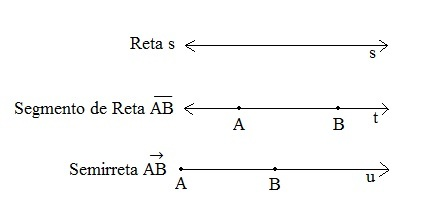
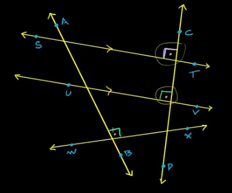
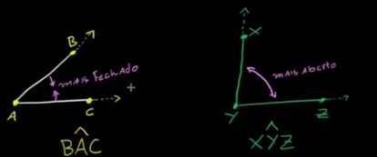

# Semana 3

## Matematica (Geometria)

Material de estudo
- https://pt.khanacademy.org/math/geometry-home
### Entendimento sobre retas
Um pouco sobre retas da geometria no plano cartesiano R² existem as retas onde podemos classificar:
- Reta
- Segmento de reta
- Semireta

- $s$ é uma reta sem inicio ou fim (matematicamente)
- $\overline{AB}$ é um segmento da reta $t$ com inicio e fim
- $\overrightarrow{AB}$ é uma semirreta da reta $u$, onde o inicio $A$ segue para $B$ dentro de uma reta

### Retas paralelas e perpedinculares

- Paralela: quando estão no mesmo plano e quando as retas infinitamente(matematicamente) manterão a distância entre elas
- Perpendicular: são retas que colidem com um angulo de 90º ou angulo reto.

Na figura podemos observar a reta $\overleftrightarrow{ST}$ e $\overleftrightarrow{UV}$ estão cruando a reta $\overleftrightarrow{CD}$ com o mesmo angulo, logo podemos dizer que $\overleftrightarrow{ST}$ $\parallel$ $\overleftrightarrow{UV}$ (paralelas). Enquanto isso podemos dizer que $\overleftrightarrow{ST}\bot\overleftrightarrow{CD}$, $\overleftrightarrow{UV}\bot\overleftrightarrow{CD}$ e $\overleftrightarrow{AB}\bot\overleftrightarrow{WX}$ são perpendiculares.

### Angulos

Quando duas semirretas tem um ponto comum(origem) formando um angulo onde podemos medir utilizando os graus ou radianos.
Podemos classificar os angulos em algumas terminologias:
- Ângulo agudo: é um ângulo de 0° graus até 90° graus (não incluso)
- Ângulo obtuso: é um ângulo de 90°(não incluso) 
- Ângulo reto: é um ângulo de exatamente 90° graus
- Reta: quando o ângulo é de 180° graus

continua...