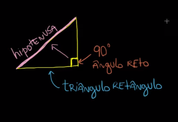
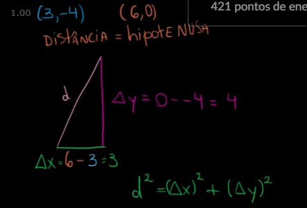

# Semana 4

## Matematica (Geometria)

Material de estudo
- https://pt.khanacademy.org/math/geometry-home/geometry-pythagorean-theorem

### Teorema de Pitágoras

O triangulo retangulo tem a especificidade dos lados ocorrerem que o comprimento do segmento de reta maior (hipotenusa) é igual a soma quadratica dos outro lados.

- **"a"** é o segmento de reta hipotenusa
- **"b e c"** são segmentos de reta para os outros lados (catetos)

$$ a^2 = b^2 + c^2 $$

### Distância entre pontos

Um ponto no plano cartesiano é dado: P = (x, y) onde P é uma referência ao ponto, **x** é a distância da Origem (0) no eixo horizontal e o **y** é a distância da Origem (0) no eixo vertical.

A distância entre dois pontos é uma aplicação do teorema de pitagorás, assim temos a diferença dos pontos no eixo horizontal e vertical.

$$ \Delta{X} = X_{final} - X_{inicial} $$
$$ \Delta{Y} = Y_{final} - Y_{inicial} $$

logo:

$$ D^2 = (\Delta{X})^2 + (\Delta{Y})^2 $$

$\color{red}{*}$ lembre-se que a distância é sepre dada pelo resultado em modulo ou seja distância é sempre positiva. 

continua...